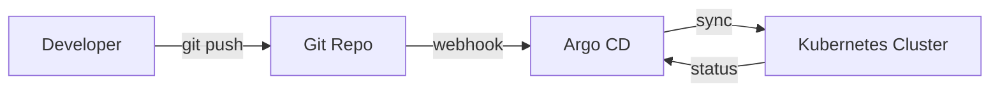

# GitOps with Argo CD

The idea behind GitOps is simple: **git is the source of truth**. The cluster
continuously reconciles itself to match what's committed. No more `kubectl apply`
from someone's laptop.

## The flow



Argo CD watches the repo, notices drift, and reconciles. If someone edits the
cluster by hand, Argo CD flags it as **OutOfSync** and can revert it.

## A minimal Application

```yaml
apiVersion: argoproj.io/v1alpha1
kind: Application
metadata:
  name: web
  namespace: argocd
spec:
  project: default
  source:
    repoURL: https://github.com/hambn/infra
    targetRevision: main
    path: apps/web
  destination:
    server: https://kubernetes.default.svc
    namespace: web
  syncPolicy:
    automated:
      prune: true
      selfHeal: true
```

With `selfHeal: true`, manual changes get reverted automatically. With `prune: true`,
deleting a manifest from git deletes it from the cluster.

## Lessons learned

1. Keep app config and cluster config in separate repos.
2. Use `prune` carefully in production.
3. The Argo CD UI is genuinely great for debugging sync issues.
